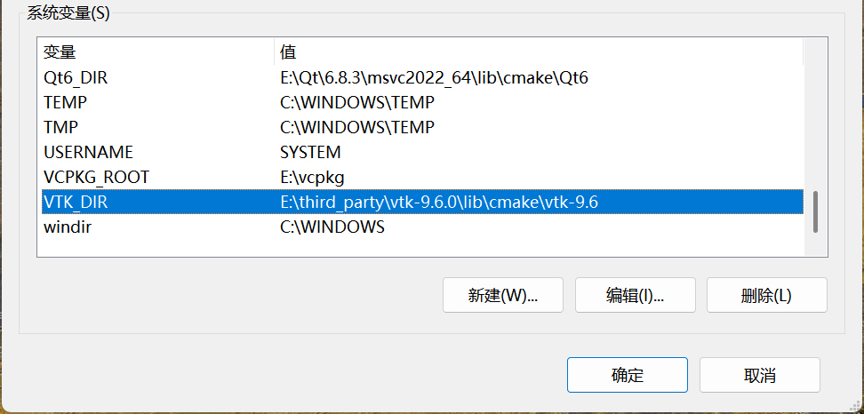
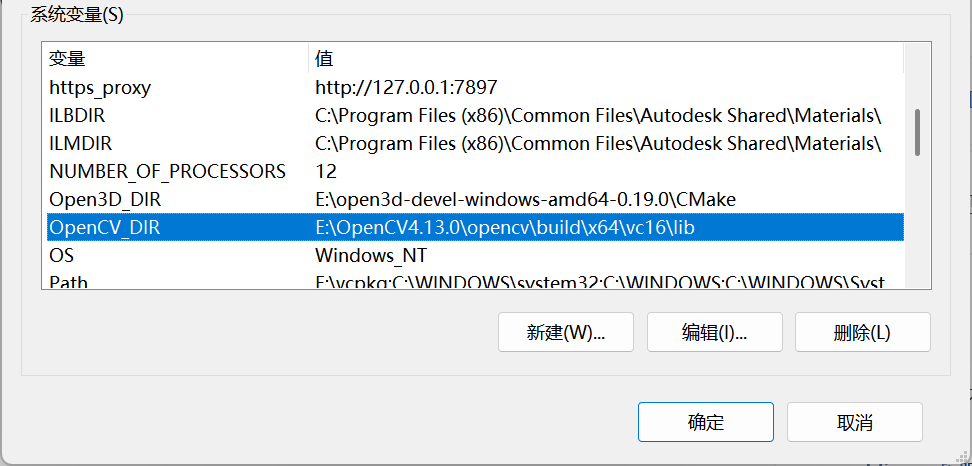
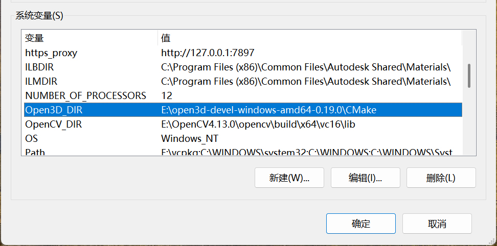
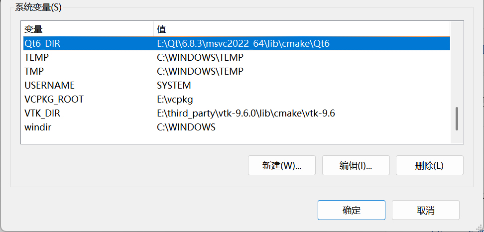
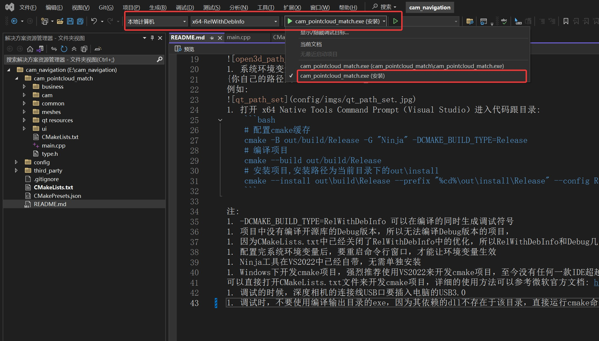

# 全息影像导航项目

## 编译步骤:
1. 通过国内镜像源安装qt6.8.3(几分钟就可以安装完)，安装msvc2022_64模块、WebSocket模块和cmake编译模块
1. 安装Visual Studio 2022或者Visual Studio最新版,勾选C\++桌面开发工具、Windows最新SDK、C++ CMake工具(不喜欢用VS开发cmake工程可不安装)
1. 安装最新的cmake程序，也可以不安装，因为Visual Studio中已经自带cmake工具了，但是版本不一定是最新的，如果
自行安装，要将cmake的bin目录添加到系统环境变量Path中
1. 在系统环境变量中，设置VTK的路径VTK_DIR：
{你自己的目录}vtk-9.6.0\lib\cmake\vtk-9.6  
例如:  

1. 在系统环境变量中，设置OpenCV的路径OpenCV_DIR：
 {你自己的目录}OpenCV4.13.0\opencv\build\x64\vc16\lib  
例如:  

1. 在系统环境变量中，设置Open3D的路径Open3D_DIR：
{你自己的路径}open3d-devel-windows-amd64-0.19.0\CMake  
例如:  
  
1. 系统环境变量中，设置Qt的路径Qt6_DIR：
{你自己的路径}Qt\6.8.3\msvc2022_64\lib\cmake\Qt6  
例如:  

1. 打开 x64 Native Tools Command Prompt（Visual Studio）进入代码跟目录:
	```bash
	# 配置cmake缓存  
	cmake -B out/build/Release -G "Ninja" -DCMAKE_BUILD_TYPE=Release
	# 编译项目
	cmake --build out/build/Release
	# 安装项目,安装路径为当前目录下的out\install
	cmake --install out\build\Release --prefix "%cd%\out\install\Release" --config Release
	```

注:
1. -DCMAKE_BUILD_TYPE=RelWithDebInfo 可以在编译的同时生成调试符号
1. 项目中没有编译开源库的Debug版本，所以无法编译Debug版本的项目，
1. 因为CMakeLists.txt中已经关闭了RelWithDebInfo中的优化，所以RelWithDebInfo和Debug几乎一模一样
1. 配置完系统环境变量后，要重启命令行窗口，才能让环境变量生效
1. Ninja工具在Visual Studio中已经自带，无需单独安装
1. Windows下开发cmake项目，强烈推荐使用Visual Studio来开发cmake项目，Visual Studio中已经集成了cmake开发工具，
可以直接打开CMakeLists.txt文件来开发cmake项目，详细的使用方法可以参考微软官方文档: https://learn.microsoft.com/zh-cn/cpp/build/cmake-projects-in-visual-studio?view=msvc-170
1. 调试的时候，深度相机的连接线USB口要插入电脑的USB3.0
1. 调试时，不要使用编译输出目录的exe，因为其依赖的dll不存在于该目录，直接运行cmake命令安装工程时的输出目录的exe，可进行调试，pdb已经通过cmake命令安装到了cmake该工程安装目录,Visual Studio中调试时，调试的目标进行如下图设置，就可以使用工程安装目录的exe
